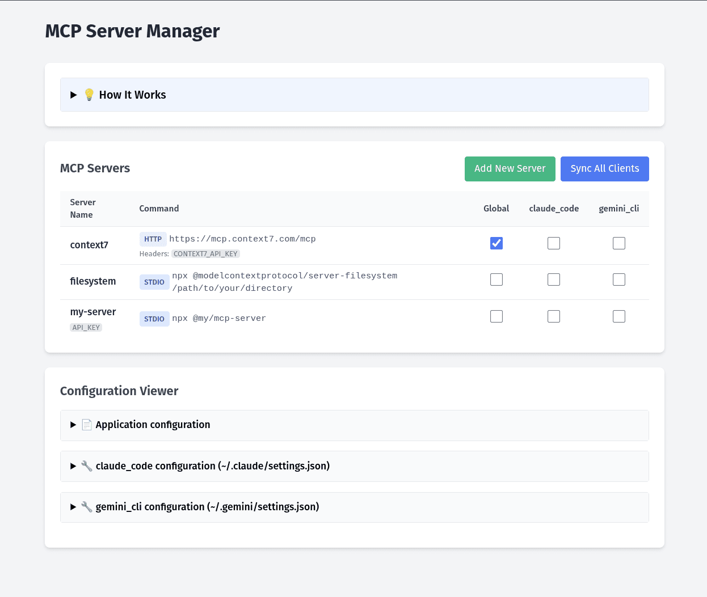

# MCP Server Manager

## What Problem Do We Solve?
**Solve the hassle of manually editing various JSON files for different MCP clients**

Managing Model Context Protocol servers across multiple AI clients (Claude Code, Gemini CLI, etc.) requires manually editing separate JSON configuration files for each client. This is tedious, error-prone, and hard to maintain.

## Why Choose MCP Server Manager?

- ✅ **Single Binary** - No dependencies, just download and run
- ✅ **Single Simple Config File** - One YAML file controls everything
- ✅ **All Operating Systems** - Works on Linux, macOS, Windows
- ✅ **All MCP Clients** - Supports Claude Code, Gemini CLI, and more
- ✅ **GUI Interface** - Web interface starts with computer, always available on localhost:6543
- ✅ **Add Servers via Web UI** - No need to edit configuration files manually
- ✅ **Real-time Validation** - Instant feedback on configuration errors
- ✅ **Example Configurations** - Built-in examples for common server types

## Screenshot



*The web interface provides an intuitive way to manage and add MCP servers across multiple AI clients with real-time validation*

## Installation Options

### Option 1: Debian/Ubuntu Package (Recommended)
```bash
# Download the latest .deb from GitHub Releases
wget https://github.com/vlazic/mcp-server-manager/releases/latest/download/mcp-server-manager_Linux_x86_64.deb

# Install the package
sudo dpkg -i mcp-server-manager_Linux_x86_64.deb

# Enable and start the service
systemctl --user enable --now mcp-server-manager
```

### Option 2: Download Release Binary
```bash
# Download and extract
wget https://github.com/vlazic/mcp-server-manager/releases/latest/download/mcp-server-manager_Linux_x86_64.tar.gz
tar -xzf mcp-server-manager_Linux_x86_64.tar.gz
chmod +x mcp-server-manager

# Run directly (config will be auto-created)
./mcp-server-manager

# Or specify custom config location
./mcp-server-manager --config /path/to/config.yaml
./mcp-server-manager -c /path/to/config.yaml
```

### Option 3: Build from Source
```bash
git clone https://github.com/vlazic/mcp-server-manager.git
cd mcp-server-manager

# Build only
make build

# Build, install, and start as system service
make setup
```

## Configuration

### Config File Locations (Smart Resolution)
The application automatically finds your configuration file in this priority order:

1. **Command line flag**: `--config /path/to/config.yaml` or `-c /path/to/config.yaml`
2. **User config**: `~/.config/mcp-server-manager/config.yaml` (recommended)
3. **Current directory**: `./config.yaml`
4. **Embedded default**: Auto-created if none found

### First Run
On first run, a default configuration will be automatically created at:
```
~/.config/mcp-server-manager/config.yaml
```

Edit this file to configure your MCP servers and client paths.

## How It Works

1. **Configure once** - Add servers via web UI or edit the auto-created config file
2. **Control from GUI** - Use the web interface to enable/disable servers per client
3. **Automatic sync** - Changes are automatically applied to all client config files
4. **Always available** - Runs in background, accessible at http://localhost:6543

## Adding MCP Servers

### Option 1: Via Web Interface (Recommended)
1. Open http://localhost:6543
2. Click "Add New Server"
3. Choose from example configurations or enter your own
4. Submit and the server is automatically added to your config

### Option 2: Edit Configuration File
Manually edit `~/.config/mcp-server-manager/config.yaml` and restart the service.

### Example Server Configuration
```json
{
  "mcpServers": {
    "filesystem": {
      "command": "npx",
      "args": ["@modelcontextprotocol/server-filesystem", "/path/to/directory"]
    }
  }
}
```

## Example Configuration

```yaml
server_port: 6543

mcp_servers:
  - name: "filesystem"
    command: "npx"
    args: ["@modelcontextprotocol/server-filesystem", "/path/to/your/directory"]
    enabled_globally: true
    clients:
      claude_code: true
      gemini_cli: false

clients:
  - name: "claude_code"
    config_path: "~/.claude/settings.json"
  - name: "gemini_cli"
    config_path: "~/.gemini/settings.json"
```

**That's it!** No more manual JSON editing across multiple files.

## Service Management

### Systemd User Service Commands
```bash
# Check service status
systemctl --user status mcp-server-manager

# Start/stop service
systemctl --user start mcp-server-manager
systemctl --user stop mcp-server-manager

# Enable/disable auto-start
systemctl --user enable mcp-server-manager
systemctl --user disable mcp-server-manager

# View logs
journalctl --user -u mcp-server-manager -f

# Restart after config changes
systemctl --user restart mcp-server-manager
```

### Enable Auto-start on Boot
```bash
# Enable lingering to start user services at boot
sudo loginctl enable-linger $USER
```

## Command Line Options

```bash
# Run with default config resolution
./mcp-server-manager

# Specify custom config file
./mcp-server-manager --config /path/to/config.yaml
./mcp-server-manager -c /path/to/config.yaml

# View help
./mcp-server-manager -h
```

## Troubleshooting

### Config File Issues
- Check if config file exists: `ls ~/.config/mcp-server-manager/config.yaml`
- View current config location in logs
- Test config syntax: ensure valid YAML format

### Service Issues
- Check service logs: `journalctl --user -u mcp-server-manager -f`
- Ensure port 6543 is available
- Verify MCP server commands are in PATH (e.g., `npx` available)
